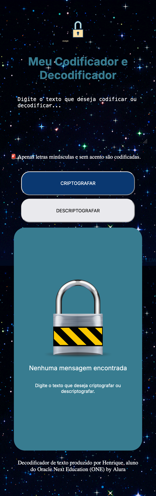
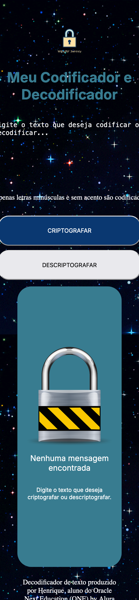

# Decodificador de Texto - Projeto ONE (Oracle Next Education)

Este é um projeto de decodificador de texto desenvolvido como parte do programa Oracle Next Education (ONE). O decodificador permite a criptografia e descriptografia de mensagens de acordo com uma chave de substituição específica. O objetivo principal é fornecer uma ferramenta simples que criptografa texto de maneira personalizada e permite a decodificação do texto criptografado de volta à sua forma original.

## Links do projeto funcionando:
- [Ver Projeto no Github Pages](https://hexdexdev.github.io/challenge-my-decodificador-de-texto/)
- [Ver Projeto na Vercel](https://challenge-five-rho.vercel.app)

## Vídeo demonstração:

Screenshot navegador Computador:

## Funcionalidades

### Criptografar
- **Chave de Substituição:**
  - A letra "e" é convertida para "enter".
  - A letra "i" é convertida para "imes".
  - A letra "a" é convertida para "ai".
  - A letra "o" é convertida para "ober".
  - A letra "u" é convertida para "ufat".
- **Exemplo de Criptografia:**
  - A palavra "gato" é criptografada para "gaitober".

### Descriptografar
- **Processo Reverso:**
  - O texto criptografado pode ser retornado à sua forma original usando a chave inversa.
- **Exemplo de Descriptografia:**
  - A palavra "gaitober" é descriptografada para "gato".

## Desafios do projeto

Consegui trabalhar a responsividade do projeto no computador, garantindo que a aplicação se dimensione corretamente ao reduzir ou aumentar o navegador. O layout se adapta bem a diferentes tamanhos de tela, oferecendo uma experiência de uso consistente em monitores e laptops. 

Imagem do app reduzido ao máximo na janela do navegador no computador:

Note, porém, que o app ainda não está 100% responsivo, pois ao utilizar a função de visualização em dispositivos móveis, como iPhone 12 ou Samsung, a responsividade ainda apresenta algumas limitações e não está completamente otimizada para essas plataformas.

Imagem do projeto no celular pelo Chrome Tools:

Ao longo do desenvolvimento deste projeto, enfrentei uma série de desafios que testaram minhas habilidades e minha persistência. Um dos maiores obstáculos foi a utilização da função Flexbox. Tive bastante dificuldade para entender e aplicar o Flexbox de maneira eficaz. Foi necessário realizar muitas pesquisas e experimentar diversas abordagens até que o sistema finalmente funcionasse da forma esperada. Embora o código pareça estar funcional e sem erros, acredito que posso ter incluído alguma redundância, pois a questão do Flexbox ainda é algo que preciso praticar muito mais. Flexbox é um assunto complexo e confuso de entender, devido às inúmeras variáveis envolvidas.

Outro grande desafio foi fazer a criptografia funcionar corretamente. Dediquei muito tempo pesquisando e experimentando diferentes abordagens para implementar a criptografia. Depois de conseguir fazer a criptografia funcionar, encontrei dificuldades ao tentar utilizar o mesmo parâmetro para a descriptografia, o que me levou a realizar novas pesquisas e ajustes no código.

Em suma, foi um desafio gostoso! Consegui implementar alguns recursos que nem imaginaria que seria capaz. Adicionei uma imagem gif de fundo, implementei um botão para copiar o texto, coloquei um favicon e habilitei uma mensagem pop-up quando um texto é copiado. Esses avanços me deram um grande senso de realização e me motivaram a continuar aprendendo e aprimorando minhas habilidades.

## Melhorias Futuras Planejadas

Pretendo continuar aperfeiçoando o projeto à medida que o meu conhecimento em programação for aumentando. Algumas das melhorias futuras que planejo implementar incluem:

- **Tornar o projeto 100% responsivo em todos os dispositivos móveis:** Melhorar a responsividade para que o layout e as funcionalidades se ajustem perfeitamente a todos os tamanhos de tela, incluindo dispositivos móveis como iPhone, Samsung, tablets, etc.

- **Incluir um botão "Limpar" para a textarea:** Adicionar uma funcionalidade que permita ao usuário limpar o campo de texto de forma fácil e rápida, facilitando a entrada de novos textos sem a necessidade de apagar manualmente o conteúdo existente.

- **Tornar o segredo de criptografia mais complexo:** Ampliar a complexidade do algoritmo de criptografia, incluindo todas as letras do alfabeto, símbolos, letras maiúsculas e minúsculas, números, entre outros, para criar uma criptografia mais robusta e segura.

- **Criar uma função para exportar o texto criptografado:** Implementar uma funcionalidade que permita ao usuário exportar o texto criptografado, possibilitando o download do conteúdo em formatos como .txt ou .md, para uso posterior ou compartilhamento ou armazenamento.

